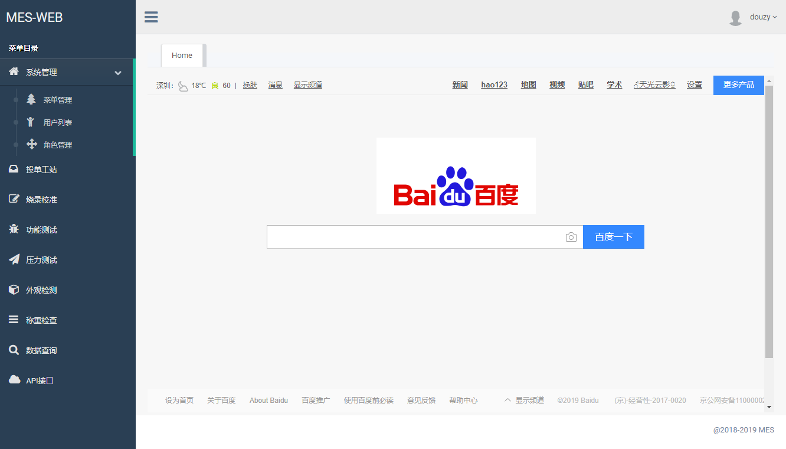

# ssm 框架整合样例
## 项目背景
##### 早些时间,接了一个小项目,设计一个数据采集系统.要求有基本的权限管理,对外接口,数据查询与删除功能.项目很小,就使用SSM架构整合一下.

## 技术整合
##### 
* 主要架构 springMVC,spring,mybatis,swagger-ui,shiro,pageHelper
* 前端组件 layerui,bootstrap,jquery,js
* 数据库 mysql
## 功能模块
登陆,菜单权限,用户管理,角色管理,接口API,邮件服务,软件授权等
## 效果图

## 运行环境说明
待补充

